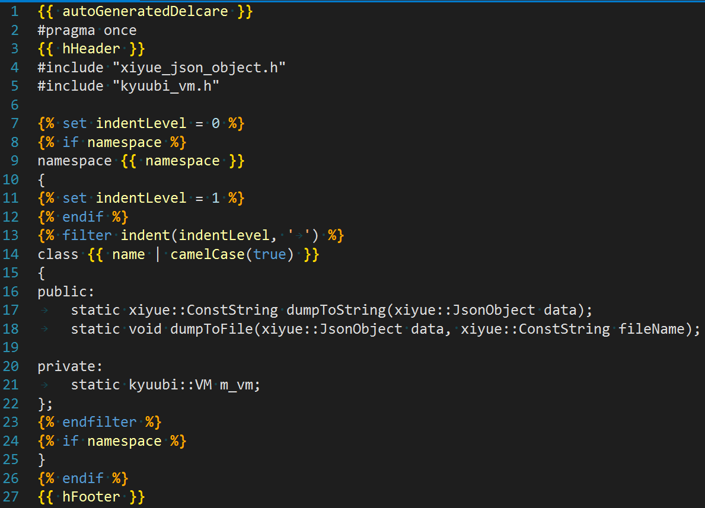

# kyuubi

## 基本介绍

`kyuubi` 是一个基于 `C++` 实现的字符串模板库。它依赖于 `xiyue-studio` 的 `xiyue` 基础库。

用户只需要定义好替换模板，以及提供好需要填充的 `json` 数据，就可以自动生成目标文件。
例如，现在有以下 `json` 数据：

```json
{
	"name": "Tecyle",
	"age": 18,
	"hobby": ["sleep", "eat", "dreaming"]
}
```

然后，按照 `kyuubi` 的语法格式，定义了如下字符串模板：

```
Hello! I am {{ name }}, and I am {{ age + " years old" }}.
My hobbies are:

* {{ h }}.;

```

只需要编写以下代码，就可以完成替换：

```cpp
Kyuubi kb = L"Hello! I am {{ name }}, and I am {{ age + \" years old\" }}.\r\n"
	L"My hobbies are:\r\n"
	L"\r\n"
	L"* {{ h }}.;\r\n"
	L""_cs;
JsonObject data = JsonObject::object({
	{L"name", L"Tecyle"},
	{L"age", 18},
	{L"hobby", JsonObject::list({L"sleep", L"eat", L"dreaming"})}
	});
ConstString result;
EXPECT_TRUE(kb.genreateToString(&data, result));
ConstString expectedResult = L"Hello! I am Tecyle, and I am 18 years old.\r\n"
	L"My hobbies are:\r\n"
	L"* sleep;\r\n"
	L"* eat;\r\n"
	L"* dreaming.\r\n"_cs;
EXPECT_CONST_STRING_EQ(result, expectedResult);
```

最终，输出的字符串为：

```
Hello! I am Tecyle, and I am 18 years old.
My hobbies are:
* sleep;
* eat;
* dreaming.
```

## 文件模板

`kyuubi` 同样支持从扩展名为 `.wanling` 的文件中读入模板字符串，并替换数据，最后再输出到指定文件中。

我在 VS 中为 `.wanling` 文件写了语法高亮插件，看起来大致效果如下：



## 生成解析源码

除了可以运行时载入模板替换之外，还可以根据预先准备好的模板，生成对应的解析源码。

有些业务场景下，需要替换的模板是固定的，没必要在运行时再去载入模板并解析。
这个时候，可以用 `KyuubiGenerator` 预先将模板生成虚拟机指令，然后，
只需要在您的项目中 include 自动生成的源代码参与编译即可。

## `kyuubi` 语法简介

### 插值表达式

用 `{{` 和 `}}` 包围的表达式，被称作插值表达式，
其作用是，从传入的 json 数据中计算表达式的值，并替换到原位置上。

例如，传入的 json 对象中存在名为 `name` 的成员，值为 `Tecyle`，
那么，` I am {{ name }}` 就会识别 `name`，并将其替换为 `Tecyle`，
最终替换到原字符串中，成为 `I am Tecyle`。

插值表达式中支持四则运算和括号，并且支持以 `a['b']` 和 `a.b` 这两种方式引用子成员。

插值表达式可以用过 `|` 符号来使用过滤器。过滤器本质上就是对表达式结果进行进一步处理的函数调用。

例如，有以下表达式 `{{ name | camelCase }}`，
其含义为，对 `name` 应用名为 `camelCase` 的过滤器，
而这个过滤器的作用为，将表达式结果转换为驼峰形式。

如果，`name` 的内容为 `this-is-test`，那么，应用过滤器后，
结果就会变为 `thisIsTest`。

过滤器可以嵌套调用，例如 `{{ name | filter1 | filter2(arg1, arg2) | ... }}`。

### raw 语句

`` 和 `` 之间，表示内部的内容不做任何解析，原样输出。

### 条件结构

条件结构语法如下：

```

    ...

    ...

    ...

```

### 循环结构

循环结构语法如下：

```

    ....

```

如果是对 map 进行遍历，则这样写：

```
(% for (key, value, index) in map %}
```

循环过程中，可以通过 `loop` 变量获取循环的状态。
目前，仅支持 `loop.isLastItem` 来判断循环是否到最后一项。

### set 语句

```

```

### filter 语句

`filter` 块可以对一块文本应用一个过滤器。

```

    ...


```

## 注释

`{# ... #}` 表示注释。注释会被忽略。

## 空白处理

插值表达式的前后空白都会原样保留。

语句与注释前后的空白都会删除。
如果一个语句占了一行，则这一整行都不会保留。

后续内容还在不断完善中...